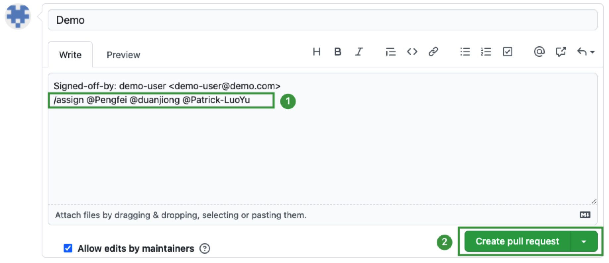

# PorterLB Website

Welcome to the PorterLB website repository!

This repository contains web pages of the [official PorterLB website](https://porterlb.io), including documentation, blog articles, community information, and other contents of the [PorterLB open-source project](https://github.com/kubesphere/porterlb).

No matter you are a tech enthusiast, a language professional, or simply someone interested in the PorterLB project, you are always welcome to send your works to the PorterLB website and help localize the website!

## Localize the PorterLB Website

We are currently looking for people to localize the website. If you have passion for localization, please [send pull requests](#send-pull-requests) to this repository.

* Before you start working, please read the [PorterLB Chinese Documentation Style Guide](./porterlb-chinese-documentation-style-guide.md).

* All documents of the PorterLB website are stored in the `/content` directory.

* If you need to insert an image in a document, save the image in a directory named after the document in the `/static/images/zh` directory and reference the image by using the following expression (change everything in `<>` to actual values):

  ```bash
  
  ```

  Don't worry if the images are not correctly displayed in your editor. They will be correctly parsed by the website.

## Send Pull Requests

If you have documents, blog articles, or localization works for the PorterLB project, please send pull requests to this repository.

Step 1: Create a GitHub account and set up a local PorterLB website repository.

1. Create a [GitHub account](https://github.com/join).

2. In the [PorterLB website repository](https://github.com/kubesphere/porter-website), click  in the upper-right corner to fork this repository to your own GitHub account.

3. In your local command-line interface (CLI), run the following commands to clone the PorterLB website repository and go to the `porter-website` directory.

   ```bash
   git clone <Address of your own PorterLB website repository>
   ```

   ```bash
   cd porter-website
   ```

4. Run the following command to set the upstream address:

   ```bash
   git remote add upstream https://github.com/kubesphere/porter-website
   ```

Step 2: Add your work and push it to GitHub.

1. Run the following command to synchronize your local repository with the upstream:

   ```bash
   git pull --rebase upstream master
   ```

2. Run the following command to create a branch and switch to the branch:

   ```bash
   git switch -c <Custom branch name>
   ```

3. Use your favorite editor (such as [Typora](https://typora.io/)) to add contents to or edit existing contents in the `/content` directory.

Step 3: Preview your work in your local environment.

1. [Install Hugo](https://gohugo.io/getting-started/quick-start/) in your local environment.

2. Go to the `porter-website` directory and run the following command:

   ```bash
   hugo server -D
   ```

3. Open a web browser and enter `http://localhost:1313` in the address box to preview your work.

Step 4: Commit your changes and create a pull request.

1. Run the following commands to commit your changes and push it to your own repository on GitHub:

   ```bash
   git add .
   ```

   ```bash
   git commit -s -m "<Desribe your changes briefly>"
   ```

   ```bash
   git push -u origin <Custom branch name>
   ```

2. Visit the [PorterLB website repository](https://github.com/kubesphere/porter-website), click **Pull requests**, and click **Compare & pull request**.

3. Add `/assign @Pengfei @duanjiong @Patrick-LuoYu` in the text box to assign the three guys to review your work.

   

4. Click **Create pull request**. After your work is reviewed, it will be merged into the repository and become available to users around the world.

5. In your local CLI, run the following command to switch to the master branch. Repeat Step 2 to Step 4 each time you have something new for the PorterLB website.

   ```bash
   git switch master
   ```

## Contact Us

Join us at the [Slack #sig-docs channel](https://kubesphere.slack.com/archives/C010WA9EW01)!